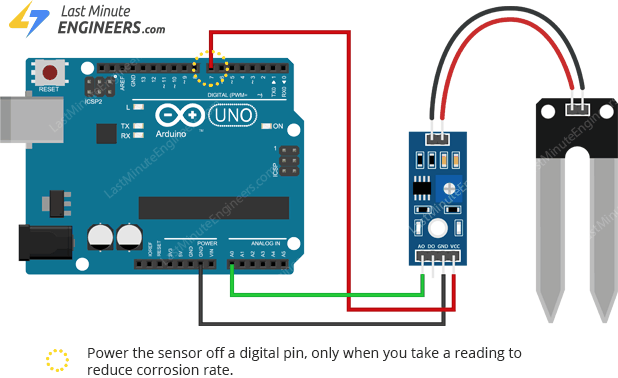

connect your Arduino to your computer via USB cable
and then run the python program

```

pip install -r requirements.txt

python main.py

```

pay attention to the port name, it should be different depending on the USB port and OS


